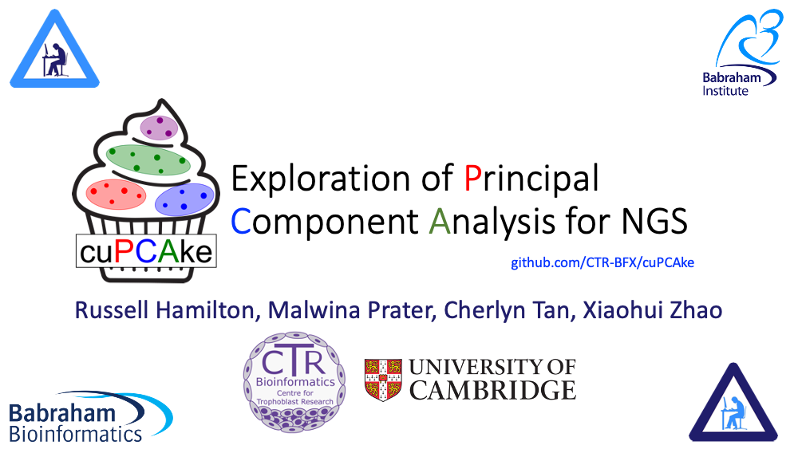
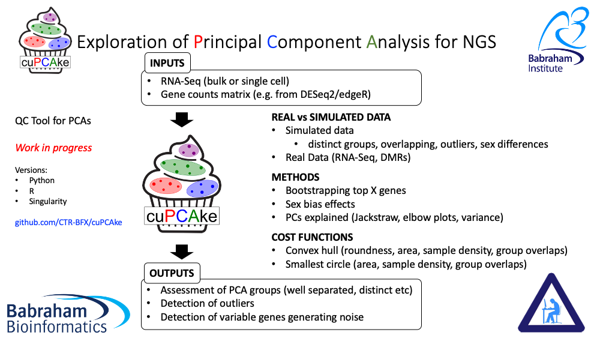
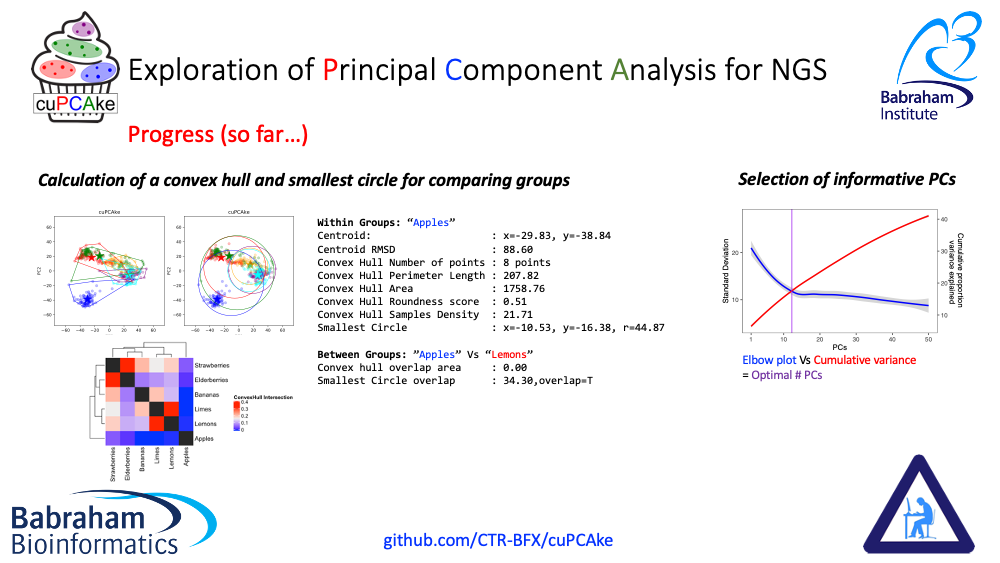

# cuPCAke: Exploration of Principal Component Analysis for NGS

Work in progress. Code to appear as soom as we have a working version ready

Project initiated as part of the [Cambridge Bioinformatics Hackathon](https://cambiohack.uk) organised by [Babraham Bioinformatics](https://www.bioinformatics.babraham.ac.uk)

### Contact:
Russell Hamilton (rsh46@cam.ac.uk)
